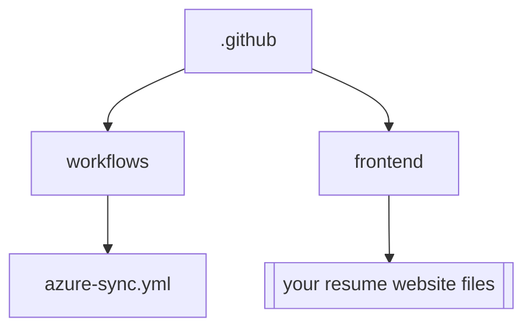

# Azure Blob Sync Action | GitHub Actions Workflow

[](https://github.com/MrGuato/Azure-Blob-Sync-Action)
[](https://app.snyk.io/org/mrguato/Azure-Blob-Sync-Action)
[](https://github.com/MrGuato/Azure-Blob-Sync-Action)
[](https://github.com/MrGuato/Azure-Blob-Sync-Action) 
[](https://opensource.org/licenses/MIT)

This repository contains a GitHub Actions workflow that automatically syncs your files to Azure Storage and manages Azure Front Door cache purging.

## Overview

The workflow automates the following tasks:

- ✅ Syncs frontend files to **Azure Blob Storage**
- ✅ Creates the **storage container** if it doesn’t exist
- ✅ Purges the **Azure Front Door cache** to ensure visitors see the latest content

## Prerequisites

Before using this workflow, ensure you have the following set up:

1. 🏗️ **Azure Account** – [Sign up](https://azure.microsoft.com/) if you don’t have one.
2. ☁️ **Azure Storage Account** – For hosting your resume website.
3. 🌐 **Azure Front Door** – For content delivery.
4. 🔑 **GitHub Repository Secrets** – Configure required secrets in your repository settings.

## Required GitHub Secrets

| Secret Name           | Description                                         |
|----------------------|-------------------------------------------------|
| `AZURE_CREDENTIALS`  | Azure service principal credentials in JSON format |
| `STORAGE_ACCOUNT_NAME` | Name of your Azure Storage account               |
| `CONTAINER_NAME`     | Name of the blob container                        |
| `RESOURCE_GROUP`     | Azure resource group name                         |
| `FRONTDOOR_NAME`     | Azure Front Door profile name                     |
| `FRONTDOOR_ENDPOINT` | Azure Front Door endpoint name                    |

## Workflow Details

### 🔄 Trigger

The workflow runs automatically when:

- Changes are **pushed to the `main` branch**
- Files in the `frontend/` directory are **modified**

```yaml
on:
  push:
    branches:
      - main
    paths:
      - 'frontend/**'
```

## 📌 Jobs and Steps

* Checkout Code – Clones your repository
* Azure Login – Authenticates with Azure using credentials
* Container Creation – Creates the blob container if it doesn’t exist
* File Upload – Uploads frontend files to Azure Storage
* Cache Purge – Purges the Azure Front Door cache

## File Structure
Your repository should have the following structure:


## Troubleshooting

### Common issues and solutions:

* Azure Login Fails:
  * Verify your AZURE_CREDENTIALS secret is properly formatted
  * Ensure the service principal has necessary permissions

* Upload Fails:
  * Check if the frontend/ directory exists and contains files
  * Verify storage account name and container name are correct

* Front Door Purge Fails:
  * Confirm resource group and Front Door names are correct
  * Ensure service principal has permissions to manage Front Door

## Contributing
Feel free to submit issues and enhancement requests. Follow these steps to contribute:

* Fork the repository
* Create your feature branch
* Commit your changes
* Push to the branch
* Create a Pull Request

## Security Notes
Never commit sensitive credentials directly in the workflow file
Regularly rotate your Azure credentials
Review GitHub Actions logs for any exposed sensitive information
